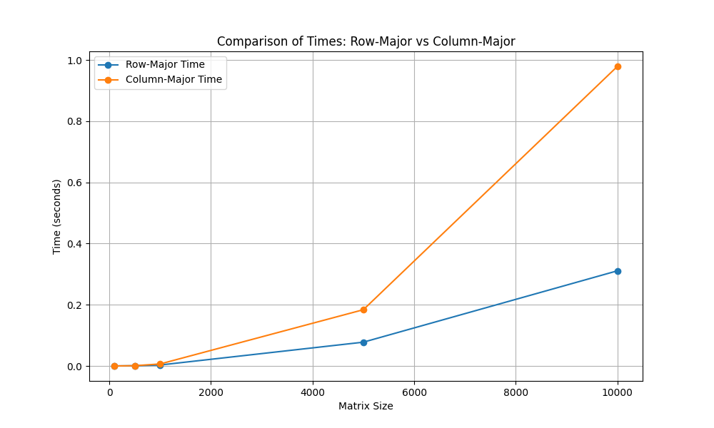
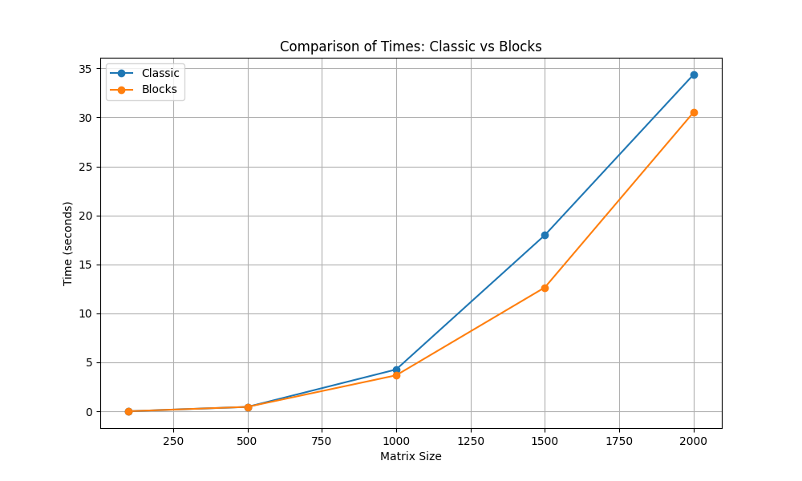

# **Cache Behavior Tests: Row-Major vs Column-Major & Classic vs Block Multiplication**

This project contains tests to measure the performance impact of cache behavior in matrix operations. The two main tests included are:

1. **Row-Major vs Column-Major Memory Access**: This test compares how different memory access patterns affect cache utilization during matrix traversal.
   
2. **Classic vs Block Matrix Multiplication**: This test compares the performance of a traditional matrix multiplication algorithm versus a cache-friendly block matrix multiplication.

---

## **Project Structure**

```
cache-behavior-tests/

├── CMakeLists.txt               
├── plot_comparison.py           
├── result/                      
│   ├── comparison_classic_blocks.png   
│   ├── comparison_row_column.png       
│   ├── times_block_classic.csv         
│   ├── times_row_column.csv            
│   └── cachegrind_*                    
├── run_analysis.sh              
├── run_tests.sh                 
└── sources/                     
    ├── main.cpp                 
    ├── main_row_column.cpp      
    ├── matrix_utils.cpp         
    ├── matrix_utils.h           
    ├── row_column.cpp           
    └── row_column.h             

```

---

## **How to Compile and Run the Project**

### **Step 1: Ensure Executable Permissions**

Before running the scripts, ensure that the necessary scripts have executable permissions. You can do this by running the following command:

```bash
chmod +x run_tests.sh run_analysis.sh
```

### **Step 2: Compile and Execute the Tests**

To compile and execute the tests, use the `run_tests.sh` script. This script compiles the C++ code using `CMake`, runs the tests for both Row-Major vs Column-Major and Classic vs Block matrix multiplication, and generates performance output (including cachegrind data).

Run the following command:

```bash
./run_tests.sh
```

This will:
- Compile the source code located in the `sources/` directory.
- Execute the tests for both memory access patterns and multiplication methods.
- Store the output and performance data in the `result/` directory, including `cachegrind` files for cache behavior analysis.

### **Step 3: Analyze Results and Generate Performance Plots**

Once the tests have been executed, you can analyze the performance results and generate comparison plots using the `run_analysis.sh` script. This script activates a Python virtual environment and runs the `plot_comparison.py` script to produce visual comparisons of the test results.

Run the following command:

```bash
./run_analysis.sh
```

This will:
- Activate the Python virtual environment (`venv`).
- Use `plot_comparison.py` to read the CSV data and generate plots comparing the results.
- Save the generated plots in the `result/` directory as `.png` files.

---

## **Test Descriptions**

### **1. Row-Major vs Column-Major Memory Access**

This test focuses on comparing two memory access patterns—**Row-Major** and **Column-Major**—and how they affect cache performance when traversing matrices. In **Row-Major**, the matrix is traversed row by row, which is cache-friendly as the memory is laid out contiguously. In contrast, **Column-Major** traversal accesses memory column by column, which typically leads to poorer cache utilization and increased cache misses due to non-contiguous memory access.

#### **Source Code Overview**:
- **`main_row_column.cpp`**: Implements the logic to traverse matrices in both row-major and column-major order.
- **`row_column.cpp`**: Contains helper functions to set up matrices and manage the traversal operations.
- **`row_column.h`**: The header file declaring the matrix traversal functions.

#### **Expected Results**:
The expectation is that row-major access will be faster than column-major due to better cache usage. The results are stored in `times_row_column.csv`.

#### **Visualization**:
The results of the test are plotted and saved in `comparison_row_column.png`. You can view the plot below:



---

### **2. Classic vs Block Matrix Multiplication**

In this test, we compare the performance of two matrix multiplication methods:

1. **Classic Multiplication**: The traditional method for matrix multiplication, which tends to be inefficient for large matrices due to poor cache utilization.
   
2. **Block Multiplication**: A cache-friendly algorithm that divides the matrix into smaller blocks. By working on these smaller blocks, the algorithm ensures that data remains in the cache longer, resulting in fewer cache misses and better performance for large matrices.

#### **Source Code Overview**:
- **`main.cpp`**: Implements both the classic and block matrix multiplication algorithms.
- **`matrix_utils.cpp`**: Provides utility functions for matrix creation and operations.
- **`matrix_utils.h`**: Header file for matrix utility functions.

#### **Expected Results**:
Block matrix multiplication should outperform classic multiplication, especially for large matrix sizes, due to improved cache locality. The results are stored in `times_block_classic.csv`.

#### **Visualization**:
The comparison between the two multiplication methods is shown in the plot below:




## **Technologies Used**

### **C++**:
- The matrix operations and tests are implemented in C++ for performance.
  
### **CMake**:
- CMake is used to manage the build process and ensure the project is easily portable across different environments.

### **Python**:
- Python is used for post-processing the results and generating comparison plots. The following libraries are used:
  - **Pandas**: To read and manipulate the CSV results data.
  - **Matplotlib**: To generate the plots comparing the performance of the different algorithms.

### **Valgrind**:
- **Cachegrind**, a tool from the Valgrind suite, is used to analyze cache behavior. The output files from cachegrind are stored in the `result/` directory.


## **Performance Comparison and CSV Results**

### **Row-Major vs Column-Major**:

The `times_row_column.csv` file contains the performance times for different matrix sizes when accessed in Row-Major and Column-Major orders. The columns are:

- **Matrix Size**: The dimensions of the matrix.
- **Row-Major Time**: The time taken to traverse the matrix in row-major order.
- **Column-Major Time**: The time taken to traverse the matrix in column-major order.

You can review the raw data in `times_row_column.csv` or see the graphical comparison in `comparison_row_column.png`.

### **Classic vs Block Matrix Multiplication**:

The `times_block_classic.csv` file contains the performance times for matrix multiplication using the classic and block methods. The columns are:

- **Matrix Size**: The dimensions of the matrix.
- **Classic Time**: The time taken using classic multiplication.
- **Block Time**: The time taken using block multiplication.

The raw data can be found in `times_block_classic.csv`, with a graphical comparison available in `comparison_classic_blocks.png`.

---

## **Conclusion**

The project highlights the importance of memory access patterns and algorithm design on cache performance. Specifically:

1. **Row-Major memory access** significantly outperforms **Column-Major** due to more efficient use of cache lines.
   
2. **Block matrix multiplication** proves to be superior to **classic matrix multiplication** for large matrices, thanks to better cache locality and reduced cache misses.

By optimizing for cache behavior, substantial improvements in computational performance can be achieved.

---

## **License**

This project is licensed under the MIT License. See the `LICENSE` file for more details.


